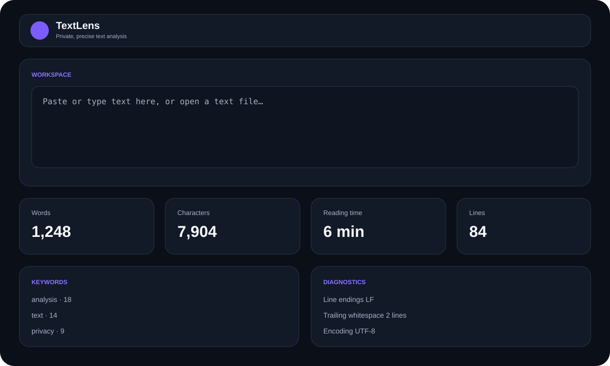

<div align="center">
  

# TextLens

**Private, precise text analysis — entirely on your device.**

[](https://github.com/sanskarIN/textlens/actions/workflows/ci.yml)
[](https://github.com/sanskarIN/textlens/actions/workflows/platform-smoke.yml)
[](https://github.com/sanskarIN/textlens/actions/workflows/security.yml)
[](LICENSE)
[](https://buymeacoffee.com/sanskarIN)

**Current source version: 2.0.12**

**Made by the Sanskar**

</div>

TextLens is an open-source desktop text analyzer for Windows, macOS, and Linux. It combines a Rust analysis engine with a lightweight Tauri + TypeScript interface and keeps document contents local by default.

## Preview



> The preview is a repository-owned UI mock that tracks the implemented layout. Release documentation will use real platform captures when packaged binaries are produced.

## Features

- Word, unique-word, longest-word, character, grapheme, sentence, paragraph, line, and byte counts.
- Configurable reading-time and speaking-time estimates.
- Ranked keyword frequency, bigrams, and trigrams.
- Local keyword-exclusion lists for hiding unhelpful words from keyword summaries without changing core counts or n-grams.
- Reusable device-local analysis presets for reading/speaking rates, result limits, and keyword exclusions.
- Whitespace diagnostics, blank-line counts, trailing-whitespace counts, and LF/CRLF/CR detection.
- Live analysis for pasted text.
- Local file analysis with UTF-8, UTF-16 BOM handling, and a clearly labelled Windows-1252 safe fallback.
- Invalid UTF-8 and undefined Windows-1252 bytes are surfaced through an encoding warning rather than silently hidden.
- Streaming analysis for large UTF-8/Windows-1252 files to avoid loading the entire document at once.
- Canonical JSON report export plus customizable Markdown export; source document text is deliberately excluded from every report.
- Markdown section picker for source metadata, core metrics, keywords, bigrams, trigrams, and whitespace diagnostics.
- Versioned JSON report schema with bounded, validated local report import and compatibility for legacy schema-v1 exports.
- Frozen schema-v2 compatibility contract for the 2.x application line, documented separately from the app version.
- Compare the current analysis with a previously exported TextLens JSON report without loading source document content.
- Versioned settings backup/restore with strict validation and a size limit.
- Optional recent-file metadata history, disabled by default, storing only display filename, size, and opened time—never full paths or source text.
- Per-entry and clear-all recent-history controls; disabling the option deletes stored metadata.
- Keyboard-first searchable Quick actions for common workflows plus direct desktop shortcuts.
- Runtime About-version display backed by packaged Tauri metadata plus a dependency-free release-version consistency gate.
- Failure-safe local preference storage with a session-only in-memory fallback when WebView persistence is blocked.
- Guarded startup recovery instead of a blank window if application initialization fails.
- Privacy-preserving manual update section that opens GitHub Releases only after explicit user action; no background update polling.
- Release-tag validation plus deterministic SHA-256 artifact checksum generation and verification tools.
- Committed npm and Cargo lockfiles enforced by CI/release automation for reproducible dependency resolution.
- Continuous no-bundle native compile smoke coverage on Windows, macOS, and Linux for relevant source changes.
- Light, dark, and system themes plus reduced-motion support.
- Keyboard shortcuts and accessible focus/semantic states.
- No account, analytics SDK, cloud API, or donation gate.

## Keyboard shortcuts

| Shortcut | Action |
|---|---|
| `Ctrl/Cmd + Shift + P` | Open Quick actions |
| `Ctrl/Cmd + O` | Open a local text file |
| `Ctrl/Cmd + E` | Open Markdown report section picker |
| `Ctrl/Cmd + K` | Focus the text editor |

## Privacy-first local preferences

Recent-file history is an explicit opt-in. It is intentionally informational rather than a reopen list, because reopening would require retaining a filesystem path. TextLens stores at most 10 metadata entries, collapses duplicate display names to the newest entry, and clears the history when the preference is disabled or defaults are restored.

Analysis presets are also local-only. A preset stores only its display name plus analysis configuration: reading/speaking rates, result limits, and keyword exclusions. It never stores document contents, source paths, recent-file entries, reports, theme, reduced-motion choice, or the recent-file-history opt-in. Up to 12 presets are retained and each name is bounded to 48 Unicode scalar values.

Settings, recent metadata, and presets share a failure-safe storage boundary. If persistent WebView storage is unavailable, TextLens attempts to continue with session-only in-memory preferences and clearly reports that persistence is unavailable. This fallback never uploads preferences or document content.

## Privacy-safe report customization

JSON exports stay complete and canonical because they are the validated import/comparison format. Markdown exports can omit any optional aggregate section. Disabling **Source metadata** removes the display filename, analysis mode, and encoding from the Markdown report. The original document text is never an available export section.

The Markdown picker is used by the visible export button, Quick actions, and `Ctrl/Cmd + E`, so all Markdown entry points share the same behavior.

## Supported platforms

| Platform | Target | Native smoke CI | Release packaging |
|---|---|---|---|
| Windows | Windows 10/11 | `windows-latest` | MSI/NSIS bundle through Tauri release builds |
| macOS | Current supported macOS | `macos-latest` | App/DMG bundle through Tauri release builds |
| Linux | Modern desktop distributions | `ubuntu-22.04` | AppImage/deb/rpm availability depends on Tauri host tooling |

The platform smoke matrix compiles the native application without creating distributable bundles. It is a continuous source-compatibility gate, not a substitute for installer, signing/notarization, accessibility, screenshot, or real packaged-release verification. See [docs/platform-support.md](docs/platform-support.md) for the complete support contract and portability rules.

## Tech stack

- **Rust** — analysis engine, file decoding/streaming, report validation/import/export, settings backup validation.
- **Tauri 2** — native desktop shell and secure IPC.
- **TypeScript** — strongly typed UI behavior, report comparison/customization, Quick actions, recent-metadata/preset validation, settings, and presentation logic.
- **Vite** — frontend development/build.
- **Vitest + Rust tests + proptest** — automated verification.
- **GitHub Actions** — frontend/Rust quality gates, three-OS native smoke compilation, security checks, release automation, and version/tag consistency enforcement.

## Quick start

### Prerequisites

Install Node.js 20.19+ (or 22.12+), Rust stable via `rustup`, and Tauri's OS-native prerequisites. See [docs/setup.md](docs/setup.md).

```bash
git clone https://github.com/sanskarIN/textlens.git
cd textlens
npm ci
npm run tauri:dev
```

`npm ci` installs the exact npm graph committed in `package-lock.json`.

## Development setup

```bash
npm ci
npm run version:check
npm run check
npm run lint
npm run format:check
npm run docs:check
npm run test
npm run build
npm run native:smoke

cd src-tauri
cargo fmt --check
cargo clippy --locked --all-targets --all-features -- -D warnings
cargo test --locked --all-targets
```

`npm run native:smoke` requires the native prerequisites for the current host and performs a Tauri debug build without packaging installers. CI additionally verifies that `src-tauri/Cargo.lock` is accepted with Cargo `--locked` before native builds.

Full guides:

- [Setup](docs/setup.md)
- [Development](docs/development.md)
- [Architecture](docs/architecture.md)
- [Testing](docs/testing.md)
- [Platform support](docs/platform-support.md)
- [Report schema compatibility](docs/report-schema.md)
- [Release](docs/release.md)
- [Troubleshooting](docs/troubleshooting.md)
- [Accessibility](docs/accessibility.md)
- [Performance](docs/performance.md)

## Build and release

Before packaging, run `npm run version:check` so npm, Cargo, and Tauri release metadata cannot silently drift apart. Install from the committed npm lockfile and verify the committed Cargo lock before packaging. Before tagging, verify that the intended tag matches the package version.

```bash
npm run version:check
npm ci --no-audit --no-fund
cargo metadata --manifest-path src-tauri/Cargo.toml --locked --no-deps --format-version 1
npm run release:tag-check -- v2.0.12
npm run tauri:build
```

After collecting final platform artifacts into one directory, generate and verify a SHA-256 manifest:

```bash
npm run release:checksums -- artifacts release-metadata/SHA256SUMS.txt
npm run release:checksums:verify -- artifacts release-metadata/SHA256SUMS.txt
```

Tagged releases are automated by `.github/workflows/release.yml`. See [docs/release.md](docs/release.md) before publishing artifacts.

## Architecture overview

```text
startup.ts
      │ local storage probe / guarded boot
      ▼
TypeScript/Vite UI
      │ Tauri IPC
      ▼
commands.rs
      │
      ├── domain/analyzer.rs  ← pure counting/frequency logic
      ├── fileio.rs           ← encoding + streaming adapter
      ├── report.rs           ← validated import + privacy-safe/custom Markdown export
      └── settings_backup.rs  ← validated local preference backup/restore
```

The frontend keeps comparison, Markdown export-option handling, Quick actions, recent-metadata handling, local analysis presets, settings parsing, storage reliability, and presentation helpers separate from the Rust analysis domain. Architecture decisions are recorded in [docs/adr](docs/adr).

## Report compatibility

Application version **2.0.12** continues to emit report schema **v2**. App versioning and report-schema versioning are deliberately independent. TextLens can import schema-v1 JSON reports for comparison; metrics that did not exist in v1 are not presented as meaningful comparison deltas. Unknown future schema versions are rejected rather than guessed.

Existing valid schema-v2 reports are the stable compatibility target for the TextLens 2.x line. The full compatibility rules and change requirements are documented in [docs/report-schema.md](docs/report-schema.md).

Imported reports are size-limited and validated before they reach the UI. Comparison uses only exported aggregate report data and never reconstructs or stores the original source text. JSON customization is intentionally not supported so exported JSON continues to satisfy the full report schema.

## Privacy and security

TextLens is designed for offline use. It does not send analyzed text to a server. Full source paths are not included in the analysis report, exported reports intentionally omit source document contents, Markdown can additionally omit display-name/analysis/encoding metadata, imported report comparison reads aggregate report data only, recent-file metadata is path-free and opt-in, analysis presets contain configuration only, and settings backups contain preferences only. The update section performs no background check and opens the official Releases page only when requested. See [PRIVACY.md](PRIVACY.md) and [SECURITY.md](SECURITY.md).

Do not report security vulnerabilities in a public issue.

## Testing

```bash
npm run version:check
npm ci --no-audit --no-fund
npm run check
npm run lint
npm run format:check
npm run docs:check
npm run test
npm run build
npm run native:smoke
cd src-tauri
cargo fmt --check
cargo clippy --locked --all-targets --all-features -- -D warnings
cargo test --locked --all-targets
```

See [docs/testing.md](docs/testing.md) for automated/native smoke coverage and manual acceptance across report customization/import compatibility, Unicode, settings, local analysis presets, recent metadata, Quick actions, large files, and platform release evidence.

## Contributing

Read [CONTRIBUTING.md](CONTRIBUTING.md) and the [Code of Conduct](CODE_OF_CONDUCT.md). Keep changes focused and add regression tests for bug fixes. Dependency manifest changes must include the package-manager-generated lockfile change. Report-schema changes must preserve or deliberately document compatibility behavior and update [docs/report-schema.md](docs/report-schema.md). Platform-sensitive changes must preserve the portability rules in [docs/platform-support.md](docs/platform-support.md).

## Roadmap

See [ROADMAP.md](ROADMAP.md).

## License

MIT — see [LICENSE](LICENSE).

## Support, contact, and funding

- Business: `sanskarin@outlook.in`
- Business: `sanskarin.business@gmail.com`
- Support: `supportramsandesh@gmail.com`
- GitHub: https://github.com/sanskarIN
- Project: https://github.com/sanskarIN/textlens
- Buy Me a Coffee: https://buymeacoffee.com/sanskarIN

[](https://buymeacoffee.com/sanskarIN)

Funding is optional and never changes product functionality.

---

**Made by the Sanskar**
